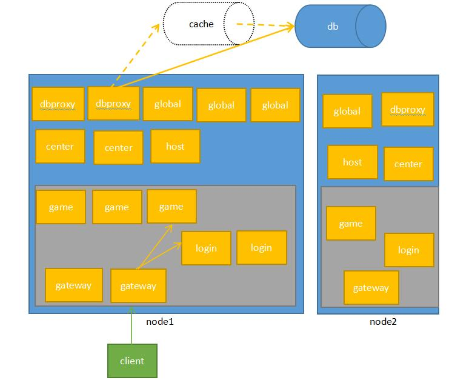

# RillServer
RillServer是一套基于skynet的通用游戏服务端框架，适合大作战、棋牌、RPG、策略等多种类型的游戏服务器。设计初衷是为了极大的提高开发效率，减少游戏开发成本。

总要取个名字，Rill小河，喻意服务畅通无阻，亦表积流成海。假以时日，厚积薄发。

##整体架构
RillServer采用传统c++服务器的架构方案。

###架构图
整体架构如下图所示，蓝色方框代表skynet节点，黄色方框代表服务，一个节点会开启game、global、login等多种服务。灰色方框代表gateway的转发范围，即客户端连上某个节点的gateway，该gateway只会将消息转发给该节点下的login和game。

###各个服务的功能：

* gateway：门，客户端只连接gateway，如果玩家尚未登录，gateway会把消息发给login，如果登录成功会转发给game
* login：登录服，处理登录逻辑
* game：游戏服，处理玩家逻辑
* center：中心服，记录玩家登录状态等信息
* global	全局服，可在此实现跨服战等功能
* dbproxy：数据库代理，使用服务不直接操作数据库，只操作dbproxy
* host：主机，用于集群控制，如热更新、关服，以及web
> ps：
> 1、一个节点的gate只会连接该节点的login和game，login和game可以连接跨节点的center、global和dbproxy。
> 2、暂时未实现cache层。
> 3、框架尽量不修改skynet代码，以便后续升级，但有些功能需要插入到原来代码里，升级时候务必修改这一部分。这些修改不会涉及核心部分，一般是增加控制台功能。若升级skynet，应该把这一部分抽出来。
>skynet/lualib/debug.lua
>skynet/service/debug_console.lua
>skynet/service/launcher.lua

###文件目录
* config：策划配置文件夹
* etc：服务配置文件夹
* luaclib：一些c模块, .so文件
* lualib：lua模块
* lualib-src：c模块代码
* mod：游戏逻辑模块
* proto：protobuf文件，若使用pb协议需要把proto文件放在里面
* run：记录pid等信息
* service：服务入口地址，服务开启后会读取mod里对应模块
* skynet：skynet框架，这里尽量少改动它，以便后续更新
* test：例子

##入门
入门章节将会介绍开启服务器以及实现echo程序，若还不太熟悉skynet和服务端编程，欢迎参考 [游戏研究院](https://zhuanlan.zhihu.com/pyluo) 中的文章。

###编译

下载代码后需要编程程序，只需要运行目录下的./make.sh all即可。服务端默认使用websocket+json的通信协议。

> **protobuf协议**
> 只要改配置就能够支持tcp（头两字节代表长度）+protobuf的格式。 服务端使用LuaPbIntf解析protobuf协议，如果使用protobuf协议，需要安装protobuf，具体如下：
>  yum nstall autoconf 
>  yum install automake 
>  yum install libtool
>  yum install glibc-headers gcc-c++
>  cd lualib-src/LuaPbIntf/third_party/protobuf
> ./autogen.sh
>  ./configure CFLAGS="-fPIC"  CXXFLAGS="-fPIC" 
>  make 
>  make install
>  vim /etc/profile，添加  LD_LIBRARY_PATH=$LD_LIBRARY_PATH:/usr/local/lib
>   ldconfig
>
>源码中对LuaPbIntf稍有改动，以适应协程下的protobuf编码解码

###运行
修改etc/runconfig.lua中的端口号，然后执行./start.sh即可开启一个游戏节点。

###echo
具体请参考示例1

----

##示例
* 示例1 echo
	     服务端./start.sh 即可运行服务端（单阶段）
	    客户端 cd test ../skynet/3rd/lua/lua 1-echo.lua
* 示例2 name  
        数据库保存测试
* 示例3 chat	
* 示例4 movegame	
* 示例5 读配置
* 示例6 日志
* 示例7 代码热更新，配置热更新
* 示例8 排行榜
	排行榜查询次数的排行榜，演示global保存数据
* 示例9 数据库断线重连
        使用示例1登录，关闭数据库，测试，重开数据库，测试  
* 示例10 关服功能
* 示例11 pb协议
* 示例12 xx大作战

----

##可以改进
*  [优化] 监视功能
*  [测试] 性能测试
*  [优化] game改成agentpool那样的，按需开启
*  [优化] 玩家存储：加一层redis
*  [必须] web鉴权
*  [必须] 未测试，mysqldb 修改成mongodb的形式。
*  [优化] web单独提取
*  [优化] 提取修改skynet的部分，不要修改skynet所有源码
*  [优化] 日志输出弄好看一点
*  [优化] log功能
*  [优化] 同一账号快速登录会出现问题
*  [bug]  watch game列表，recmmad列表（可能出错）
*  [bug]  大作战高并发下，不发送sync协议
  

##已经发现的注意点
bson：bson会把key都存为string，读取时要tonumber处理
由于dataSheet在init阶段初始化，而awake、start在init阶段前执行，修改skynet/lualib/skynet/datasheet/init.lua的querysheet函数，增加if datasheet_svr == nil then datasheet_svr = service.query("datasheet") end

内网改的
tool增加表拷贝
将player相关的都放到player文件夹（new load_data load_all_data save_all_data），改为读取pb结构保存{playerid,pbstr}

